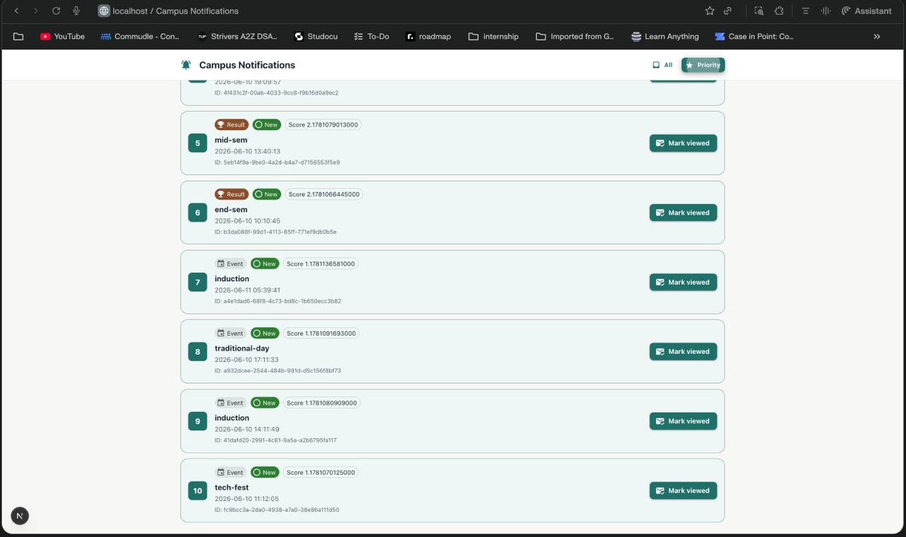
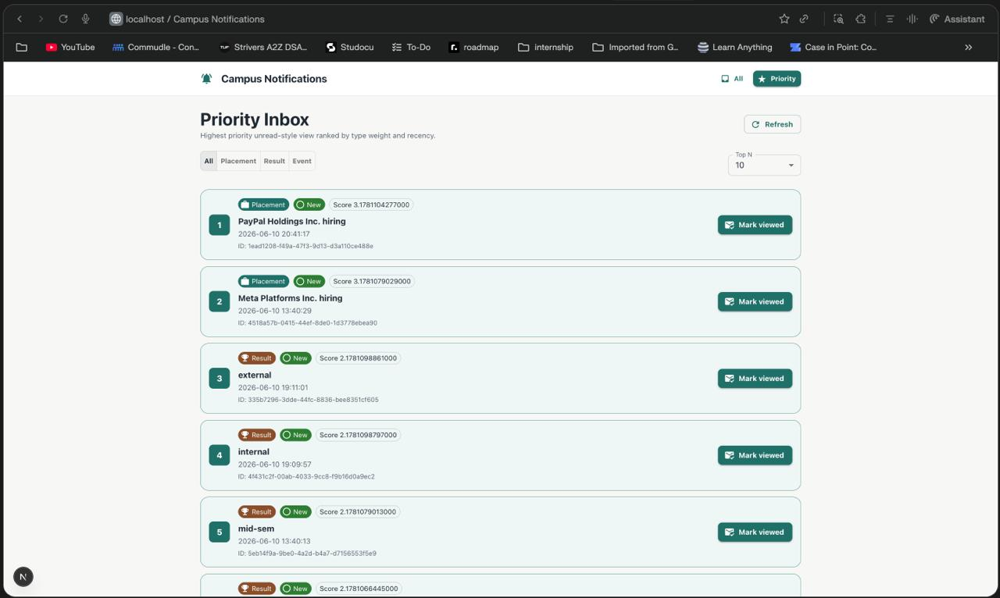
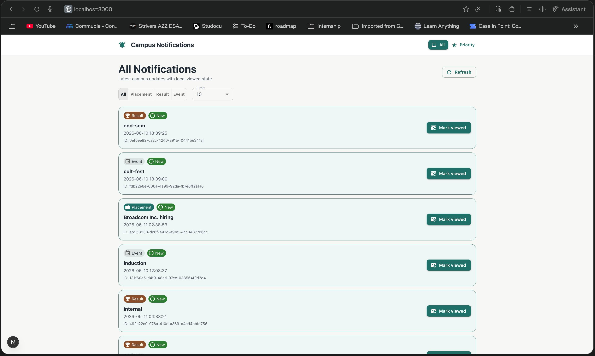

# Campus Notification System

A robust, scalable campus notification platform designed to deliver real-time updates for Placements, Results, and Events. This project demonstrates a full-stack implementation covering system design, backend logic, and a responsive frontend.

## 📺 UI Proof of Implementation
> For a deep dive into the architecture and design decisions, please refer to the [Technical Design Document](./notification_system_design.md).

### 🖥️ Web Interface (Desktop View)

**All Notifications Feed**
Displays the full layout with category filters, limit selection, and a clean, paginated list of notifications fetched from the live API.



**Priority Inbox (★ Logic Verification)**
Demonstrates the weight-based sorting algorithm (**Placement > Result > Event**) combined with recency. This view ensures critical information is never missed.



---

## 🚀 Getting Started

### 1. Prerequisites
- **Node.js**: v18.0.0 or higher
- **NPM**: v9.0.0 or higher

### 2. Installation
Clone the repository and install dependencies for all modules:
```bash
# Frontend
cd notification_app_fe && npm install

# Logging Middleware (Shared)
cd ../logging_middleware && npm install
```

### 3. Execution
**To run the Frontend (Next.js):**
```bash
cd notification_app_fe
npm run dev
```
Access the app at [http://localhost:3000](http://localhost:3000).

**To verify the Priority Algorithm (Stage 6):**
```bash
cd notification_app_be
node stage6.js
```

---

## 📡 Observability & Logging
The system features a centralized logging mechanism. Both frontend and backend components use a custom `Log()` wrapper to push observability data to the evaluation service.

**Example Log Object:**
```json
{
  "stack": "frontend",
  "level": "info",
  "package": "component_mount",
  "message": "Priority inbox successfully rendered"
}
```

---
*Developed for the Campus Hiring Evaluation.*
