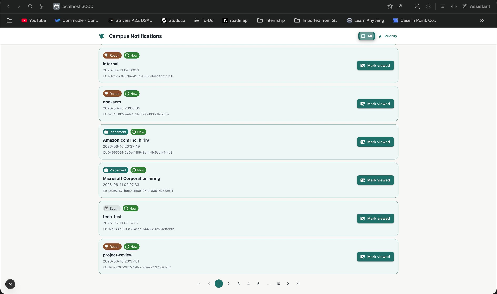

# Stage 1

## Notification System API Design

### Overview

The Campus Notification System allows students to receive real-time notifications related to:

- Placements
- Results
- Events

The system should support creating, retrieving, updating, and managing notifications efficiently while enabling real-time delivery.

---

## Authentication

All APIs require authentication.

### Headers

```http
Authorization: Bearer <token>
Content-Type: application/json
```

---

## 1. Get Notifications

Retrieve notifications for a student.

### Endpoint

```http
GET /api/v1/notifications
```

### Query Parameters

| Parameter | Type | Description |
|------------|--------|------------|
| page | number | Page number |
| limit | number | Records per page |
| notification_type | string | Event, Result, Placement |

### Response

```json
{
  "success": true,
  "data": [
    {
      "id": "1",
      "type": "Placement",
      "message": "Microsoft hiring drive announced",
      "isRead": false,
      "createdAt": "2026-06-11T10:00:00Z"
    }
  ]
}
```

---

## 2. Get Notification By ID

### Endpoint

```http
GET /api/v1/notifications/{id}
```

### Response

```json
{
  "success": true,
  "data": {
    "id": "1",
    "type": "Placement",
    "message": "Microsoft hiring drive announced",
    "isRead": false,
    "createdAt": "2026-06-11T10:00:00Z"
  }
}
```

---

## 3. Create Notification

### Endpoint

```http
POST /api/v1/notifications
```

### Request

```json
{
  "type": "Placement",
  "message": "Microsoft hiring drive announced"
}
```

### Response

```json
{
  "success": true,
  "message": "Notification created successfully"
}
```

---

## 4. Mark Notification As Read

### Endpoint

```http
PATCH /api/v1/notifications/{id}/read
```

### Response

```json
{
  "success": true,
  "message": "Notification marked as read"
}
```

---

## 5. Mark All Notifications As Read

### Endpoint

```http
PATCH /api/v1/notifications/read-all
```

### Response

```json
{
  "success": true,
  "message": "All notifications marked as read"
}
```

---

## 6. Delete Notification

### Endpoint

```http
DELETE /api/v1/notifications/{id}
```

### Response

```json
{
  "success": true,
  "message": "Notification deleted successfully"
}
```

---

## Real-Time Notification Mechanism

To provide instant updates to students, WebSockets will be used.

### Flow

1. Student opens application.
2. Client establishes WebSocket connection.
3. New notification created.
4. Server pushes notification instantly.
5. Notification appears without page refresh.

### Benefits

- Real-time delivery
- Reduced polling
- Better user experience
- Lower API traffic

---
Stage 2

Database Selection

I recommend PostgreSQL as the primary database for the notification system.

Reasons

* ACID compliance ensures data consistency.
* Supports indexing for faster queries.
* Handles large datasets efficiently.
* Supports transactions.
* Easy to scale using partitioning and replication.

Database Schema

Students Table

Column	Type
id	UUID
name	VARCHAR
email	VARCHAR

Notifications Table

Column	Type
id	UUID
student_id	UUID
notification_type	VARCHAR
message	TEXT
is_read	BOOLEAN
created_at	TIMESTAMP
updated_at	TIMESTAMP

Relationship

Student (1) → Notifications (Many)

SQL Queries

Get Notifications

SELECT *
FROM notifications
WHERE student_id = ?
ORDER BY created_at DESC
LIMIT 20 OFFSET 0;

Mark Notification as Read

UPDATE notifications
SET is_read = TRUE
WHERE id = ?;

Mark All Notifications as Read

UPDATE notifications
SET is_read = TRUE
WHERE student_id = ?;

Create Notification

INSERT INTO notifications
(id, student_id, notification_type, message, is_read, created_at)
VALUES (?, ?, ?, ?, FALSE, NOW());

Delete Notification

DELETE FROM notifications
WHERE id = ?;

Scaling Challenges

* Slow query performance as notifications grow.
* Increased storage requirements.
* Higher API response times.
* Large table scans.
* Increased load during placement seasons.

Scaling Solutions

* Add indexes on frequently queried columns.
* Use pagination.
* Partition notification tables.
* Archive old notifications.
* Use Redis caching.
* Use read replicas for scaling.

Indexing Strategy

CREATE INDEX idx_notifications_student
ON notifications(student_id);
CREATE INDEX idx_notifications_created_at
ON notifications(created_at);
CREATE INDEX idx_notifications_student_read
ON notifications(student_id, is_read);

Conclusion

PostgreSQL with indexing, pagination, partitioning and caching provides a reliable and scalable storage solution for the campus notification platform.


Stage 3

Query Analysis

Given Query:

SELECT *
FROM notifications
WHERE studentID = 1042
AND isRead = false
ORDER BY createdAt ASC;

Is the Query Accurate?

The query correctly retrieves unread notifications for a student.

However, it may return a very large number of rows if the student has accumulated many unread notifications.

Why is the Query Slow?

* Table contains millions of notifications.
* Full table scan may occur if proper indexes are absent.
* Sorting by createdAt is expensive.
* Using SELECT * fetches unnecessary columns.
* No pagination is applied.

Recommended Query

SELECT id,
       notification_type,
       message,
       created_at
FROM notifications
WHERE student_id = 1042
AND is_read = FALSE
ORDER BY created_at DESC
LIMIT 50;

Improvements

* Fetch only required columns.
* Use pagination.
* Use descending order to show latest notifications first.
* Add composite indexes.

Index Strategy

Recommended Index:

CREATE INDEX idx_student_read_created
ON notifications(student_id, is_read, created_at);

This allows filtering and sorting using the same index.

Computation Cost

Without indexes:

O(N)

Database scans millions of rows.

With proper indexing:

O(log N)

Database directly locates matching records.

Should We Index Every Column?

No.

Problems:

* Increased storage consumption.
* Slower INSERT and UPDATE operations.
* Higher maintenance cost.
* Many indexes remain unused.

Indexes should only be added on frequently queried columns.

Query: Students Receiving Placement Notifications in Last 7 Days

SELECT DISTINCT student_id
FROM notifications
WHERE notification_type = 'Placement'
AND created_at >= NOW() - INTERVAL '7 days';

Conclusion

The primary performance issue is lack of indexing and pagination. A composite index on student_id, is_read, and created_at significantly improves query performance while avoiding unnecessary table scans.


# Stage 4

## Problem Statement

Notifications are being fetched on every page load for every student. As the number of students and notifications increases, the database experiences heavy load, resulting in slower response times and poor user experience.

---

## Proposed Solutions

### 1. Pagination

Instead of loading all notifications at once, fetch notifications in smaller chunks.

Example:

GET /api/v1/notifications?page=1&limit=20

#### Benefits

- Reduces database load
- Faster API responses
- Lower memory consumption
- Better user experience

#### Trade-Offs

- Requires multiple API calls for large datasets

---

### 2. Redis Caching

Store frequently accessed notifications in Redis.

Flow:

User Request
→ Redis Cache
→ Database (only if cache miss)

#### Benefits

- Extremely fast reads
- Reduces database traffic
- Improves scalability

#### Trade-Offs

- Additional infrastructure
- Cache invalidation complexity

---

### 3. WebSockets for Real-Time Updates

Instead of fetching notifications on every page refresh, maintain a persistent WebSocket connection.

Flow:

Server
→ WebSocket
→ Client

#### Benefits

- Real-time notification delivery
- Eliminates unnecessary polling
- Better user experience

#### Trade-Offs

- Increased server connection management

---

### 4. Database Read Replicas

Use read replicas for notification retrieval.

Architecture:

Client
    |
Application Server
    |
+--------------+
|              |
Primary DB   Read Replica

#### Benefits

- Distributes read load
- Improves query performance

#### Trade-Offs

- Replication lag
- Additional infrastructure cost

---

### 5. Notification Archiving

Move old notifications to archive tables.

Example:

notifications_active
notifications_archive

#### Benefits

- Smaller active tables
- Faster queries
- Better index efficiency

#### Trade-Offs

- More complex data management

---

## Recommended Architecture

Client
    |
Load Balancer
    |
Application Server
    |
+-------------------+
|                   |
Redis Cache      PostgreSQL
                    |
               Read Replica

Real-Time Updates:
Application Server
        |
    WebSocket
        |
      Client

---

## Final Recommendation

For optimal scalability and performance:

1. Implement Pagination
2. Add Redis Caching
3. Use WebSockets for real-time delivery
4. Configure Read Replicas
5. Archive old notifications periodically

This architecture minimizes database load, improves response time, and supports large-scale notification delivery.


# Stage 5

## Problems with Current Implementation

The current implementation processes notifications sequentially.

### Issues

- Slow for 50,000 students.
- Single failure can interrupt processing.
- No retry mechanism.
- No fault tolerance.
- Email API latency affects overall performance.
- Database writes and email sending are tightly coupled.
- Difficult to recover failed notifications.

---

## Why This Design Fails

If email delivery fails for 200 students midway:

- Some students receive notifications.
- Some students do not.
- System enters an inconsistent state.
- Manual recovery may be required.

---

## Recommended Architecture

HR Request
    |
Notification Service
    |
Message Queue (RabbitMQ / Kafka)
    |
+------------------+
|                  |
Email Worker     Push Worker
|                  |
Email API      WebSocket Service

Database writes happen independently before notification processing.

---

## Save to Database First

Notification records should be stored before sending emails.

Benefits:

- Source of truth is preserved.
- Failed notifications can be retried.
- Delivery status can be tracked.
- System remains consistent.

---

## Retry Strategy

Failed notifications are retried automatically.

Example:

- Retry 1 after 1 minute
- Retry 2 after 5 minutes
- Retry 3 after 15 minutes

After maximum retries, move to Dead Letter Queue (DLQ).

---

## Revised Pseudocode

```python
function notify_all(student_ids, message):

    notification_id = save_notification(message)

    for student_id in student_ids:
        queue.publish({
            notification_id,
            student_id,
            message
        })


worker():

    while true:

        job = queue.consume()

        try:
            send_email(job.student_id, job.message)
            push_to_app(job.student_id, job.message)

            mark_success(job.notification_id)

        except Exception:
            retry(job)
```

# Stage 6

## Priority Inbox Approach

The Priority Inbox ranks unread notifications by two factors:

1. Notification type weight.
2. Recency within the same type.

Weights:

| Notification Type | Weight |
|-------------------|--------|
| Placement         | 3      |
| Result            | 2      |
| Event             | 1      |

The priority key is:

```text
(type_weight, timestamp)
```

This ensures:

- All Placement notifications rank above all Result notifications.
- All Result notifications rank above all Event notifications.
- Newer notifications rank higher only within the same notification type.

## Efficient Top 10 Maintenance

The implementation uses a fixed-size min heap of size 10.

For each notification:

1. Validate required fields: `ID`, `Type`, `Message`, `Timestamp`.
2. Convert `Type` to its configured weight.
3. Parse `Timestamp`.
4. Build a priority key.
5. Push into the heap if fewer than 10 items exist.
6. If the heap already has 10 items, compare the new notification with the weakest item at the heap root.
7. Replace the heap root only when the new notification has higher priority.

This avoids repeatedly sorting the complete dataset.

## Complexity

For `n` notifications and `k = 10`:

```text
Time:  O(n log k) = O(n log 10)
Space: O(k) = O(10)
```

Only the final heap of 10 notifications is sorted for display.

## Continuous Updates

The backend exposes:

```js
update_top_notifications(newNotification)
```

When a new notification arrives through polling, WebSocket, or another event stream, this function updates the heap in `O(log 10)` time without recalculating the full list.

## Error Handling

The implementation handles:

- API failures and non-200 responses.
- Invalid JSON.
- Missing `notifications` array.
- Empty responses.
- Missing notification fields.
- Unsupported notification types.
- Invalid timestamps.

## Logging

The Stage 6 implementation consumes the reusable Affordmed `Log(stack, level, package, message)` middleware and logs:

- Notification API request start.
- Notification API request success.
- Notification count.
- Priority calculation.
- Top 10 generation.
- Validation and API errors.

## Code Deliverable

The implementation is available at:

```text
notification_app_be/stage6.js
```

It can be executed with:

```bash
node notification_app_be/stage6.js
```

### Priority Inbox Screenshots




# Stage 7

## Frontend Implementation

The frontend is a responsive Next.js application built with Material UI, fulfilling the requirements for both a comprehensive notification view and a specialized Priority Inbox.

### Key Features

1.  **Responsive Layout**: Uses a sticky AppShell with a responsive Drawer for navigation, ensuring usability across mobile, tablet, and desktop devices.
2.  **Notification List**: Displays all notifications with support for server-side pagination and type-based filtering.
3.  **Priority Inbox**: A dedicated view that calculates the top 'n' notifications (10, 15, or 20) based on the weighted priority algorithm (Placement > Result > Event) and recency.
4.  **View State Management**: Uses browser `localStorage` to track viewed notifications, visually distinguishing between new and seen items without requiring backend persistent state for this session.
5.  **Real-Time Simulation**: Features a "Refresh" mechanism that interacts with the backend proxy to fetch the latest data from the external Notification API.
6.  **Theming**: Custom Material UI theme with a clean, professional aesthetic, prioritizing readability and highlighting critical notification types with distinct iconography and colors.

### Architecture

- **Next.js App Router**: Provides efficient routing and server-side rendering capabilities.
- **Backend Proxy Routes**: `/api/notifications` and `/api/logs` act as proxies to the external API and the logging middleware, handling authentication and error mapping.
- **Material UI**: Used exclusively for styling and component structure to ensure a production-grade UI/UX.
- **Custom Logging**: Integrated frontend logging that pushes browser events to the backend logging middleware for unified observability.

### Running the Application

1.  Navigate to the frontend directory:
    ```bash
    cd notification_app_fe
    ```
2.  Install dependencies:
    ```bash
    npm install
    ```
3.  Run the development server:
    ```bash
    npm run dev
    ```
4.  Access the application at `http://localhost:3000`.
ifications_2.jpg)
